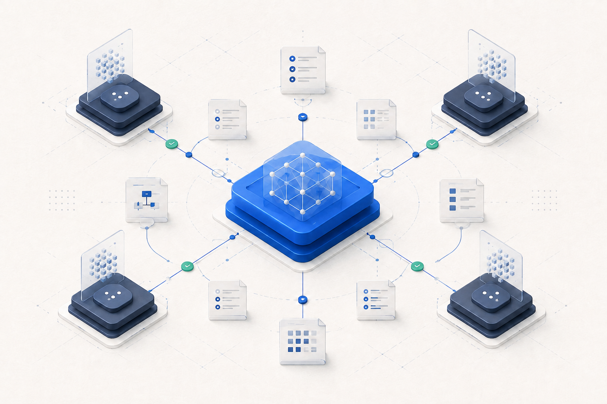

# UseAgent

[English](README.md) | Tiếng Việt

[](https://github.com/thuanlyt/UseAgent/actions/workflows/ci.yml)
[](https://github.com/thuanlyt/UseAgent/releases/latest)
[](https://www.python.org/downloads/)
[](LICENSE)

> Bộ điều phối multi-agent file-first, biến một mục tiêu dự án thành công việc có scope rõ, handover có thể kiểm tra và tiến trình release hữu hạn.

UseAgent trao cho một model đủ năng lực vai trò supervisor. Các coding agent và con người khác tham gia qua cùng một giao thức cục bộ trong repository: context dùng chung, work item rõ ràng, mailbox, evidence, review gate và checkpoint.



## UseAgent là gì?

UseAgent là workflow supervisor provider-neutral dành cho các agent local đáng tin cậy cùng làm việc trong một repository đã chuẩn bị. Supervisor đọc goal và roster ngắn, lập roadmap/DAG, dispatch task sẵn sàng, đọc report của worker, chạy QA được cấu hình và chọn hành động tiếp theo trong một cycle hữu hạn.

## Phiên bản hiện tại

**v0.1.0 — Initial Public Release / Bản phát hành công khai đầu tiên**

UseAgent v0.1.0 là bản phát hành công khai đầu tiên của control plane multi-agent file-first, trusted-local, đang ở mức Beta. Bản này kết hợp work có scope, evidence/review/QA gate, khả năng phục hồi runtime và supervisor có judgment trong một workflow chung của repository.

- [Release notes](https://github.com/thuanlyt/UseAgent/releases/tag/v0.1.0) · [Tất cả bản phát hành](https://github.com/thuanlyt/UseAgent/releases)
- [CHANGELOG](CHANGELOG.md) · [Tài liệu](https://useagent.thuanlyt.id.vn/) · [Hướng dẫn bắt đầu](docs/getting-started.md)

Repository trở thành bộ nhớ dùng chung:

```text
Goal của người dùng
    ↓
UseAgent supervisor
    ├─ project brief, knowledge ledger và task DAG
    ├─ assignment có scope trong mailbox của worker
    └─ report, evidence, review, QA và checkpoint
    ↓
Codex · Claude Code · Antigravity · worker khác · con người
    ↓
UseAgent supervisor → hành động an toàn tiếp theo hoặc blocker rõ ràng
```

CLI Python phụ trách transition và validation có tính quyết định. Model phụ trách lập kế hoạch, phán đoán và điều phối. Markdown giúp handover dễ đọc; JSON giúp registry dễ kiểm tra bằng máy.

## Vì sao nên dùng?

| Vấn đề khi phối hợp | Cách UseAgent xử lý |
| --- | --- |
| Agent nào cũng phải đọc lại cả repository | `knowledge/` cô đọng, có source anchor |
| Công việc biến mất trong hội thoại | Registry, mailbox assignment và report bền vững |
| Worker sửa trùng khu vực | Kiểm tra scope và giới hạn một active writer cho mỗi path/subtree |
| “Done” nhưng không có bằng chứng | Acceptance criteria, review evidence và check có thể chạy lại |
| Chạy lâu bị mất phương hướng | Cycle hữu hạn, checkpoint và điều kiện dừng rõ ràng |
| QA hoặc report bị cũ | Provenance, report freshness và evidence release gắn với source |

## Năng lực trong bản release hiện tại

### Lập kế hoạch và điều phối

- Front door supervisor qua `$useagent`.
- Cấp độ công việc từ L0 discovery đến L4 production/release.
- Task DAG có dependency, scope, owner, capability và capacity.
- `INBOX.md`, assignment inbox, `REPORT.md` và `COMPLETED.md` cho từng agent.
- Tự dispatch tới worker đủ điều kiện; mỗi scope chỉ có một writer đang hoạt động.

### Giám sát có judgment

- Phân biệt outcome của dự án, constraint bắt buộc, preference có thể thay đổi và solution được đề xuất.
- Phản biện kế hoạch yếu một cách có căn cứ, cân nhắc tradeoff và đưa ra một recommendation mặc định kèm confidence rõ ràng.
- Chỉ hỏi owner khi câu trả lời thực sự quyết định hướng đi, escalate hành động irreversible/external và tôn trọng owner override hợp lệ.
- Nhận biết diminishing returns và có thể đề xuất dừng khi goal cùng các gate phù hợp đã hoàn tất.

### Giữ lại bộ nhớ hữu ích của dự án

- Knowledge card và contract có source anchor, giúp giảm việc đọc lại.
- Evidence có provenance kiểu rõ: `local`, `live`, `simulation`, `blocked`, `operator-confirmed` và lịch sử tương thích `legacy`.
- Marker freshness để `work/SUPERVISOR_REPORT.md` không âm thầm trông như hiện tại khi registry đã thay đổi.
- Takeover lineage với `supersedes`, `superseded_by` và failure history được giữ nguyên.
- Cycle hữu hạn và checkpoint để resume; không có supervisor loop vô hạn.

### Kiểm tra và release an toàn

- Summary durable của output runner và QA được sanitize, giới hạn kích thước.
- Spool chẩn đoán local đã redacted tại `work/.runtime-output/`; raw runtime output mặc định không phải repository evidence.
- QA gắn với source bằng Git HEAD, dirty-state, content và QA configuration fingerprint.
- Git release durability gate: source liên quan release phải sạch, không có file release untracked ngoài ignore và QA hiện tại phải hợp lệ.
- QA dùng structured `argv` với `shell=False` mặc định; shell syntax chỉ là trusted-local opt-in rõ ràng.
- Runtime readiness hữu hạn và failure classification provider-neutral tùy chọn.
- Usage telemetry provider-neutral cho timing đo được, participant thực tế và token authoritative khi runtime cung cấp; usage thiếu vẫn là partial hoặc unavailable.
- Harness conformance không cần credential cho identity kiểu Codex, Claude Code và Antigravity.
- Không có dependency Python bên thứ ba khi chạy.

## Runtime và role được hỗ trợ

UseAgent không khóa vào một vendor model. Codex, Claude Code, Google Antigravity, runtime tương thích khác hoặc con người đều có thể làm việc trong cùng repository nếu đọc được Markdown contract, chạy được CLI và tuân thủ scope đã claim.

Runtime là bề mặt thực thi; role là trách nhiệm trong workflow:

| Role | Trách nhiệm |
| --- | --- |
| `supervisor` | Hiểu goal, lập DAG, dispatch, review evidence, chạy QA và chọn hành động tiếp theo |
| `explorer` | Discovery read-only, tìm constraint và source anchor |
| `planner` | Tách milestone thành các work item có scope |
| `worker` | Pull một assignment, implement trong scope và report check |
| `reviewer` | Kiểm tra diff, regression, security và gap của evidence |
| `release_gate` | Kiểm acceptance, vận hành, rollback và release readiness |

Xem [hướng dẫn thao tác Codex + Claude Code + Antigravity](docs/getting-started.md). Harness conformance chỉ chứng minh protocol và routing dùng chung, không tuyên bố đã gọi vendor API.

## Bắt đầu nhanh

Yêu cầu: Python 3.11+, Git và một repository dự án đã chuẩn bị. UseAgent có thể nằm trong repository đích hoặc chạy trên repository có sẵn qua `--root`.

```powershell
git clone https://github.com/thuanlyt/UseAgent.git
Set-Location UseAgent

python tools/useagent.py init
python tools/useagent.py validate
python examples/multi-agent-demo/run_demo.py
python examples/multi-runtime-conformance/run_conformance.py
```

Với một repository riêng đã chuẩn bị:

```powershell
python F:\dev\UseAgent\tools\useagent.py --root F:\dev\MyProject init
python F:\dev\UseAgent\tools\useagent.py --root F:\dev\MyProject validate
```

`--root` phải đứng trước subcommand. Nó đặt repository được chọn làm boundary cho registry, mailbox, report và các path đã cấu hình. Path nào thoát khỏi boundary sẽ bị từ chối. Xem [hướng dẫn bắt đầu](docs/getting-started.md) để chọn cách copy control plane hoặc dùng checkout trung tâm.

`main` là nhánh phát triển hiện tại. Để tái hiện snapshot v0.1.0 đã phát hành, hãy checkout tag release bất biến sau khi clone:

```powershell
git checkout v0.1.0
```

Đăng ký đúng các worker session thực tế sẽ làm việc:

```powershell
python tools/useagent.py agent register `
  --id claude-frontend `
  --role worker `
  --scope src/frontend `
  --scope tests/frontend `
  --capability web `
  --max-active 1
```

Sau đó gửi cho supervisor một prompt nhẹ:

```text
Use $useagent in F:\dev\MyProject.
Goal: build a production-ready inventory API with authentication and tests.
Agents: codex-supervisor, claude-frontend, antigravity-reviewer.
Constraints: keep scopes non-overlapping; do not deploy or change secrets without approval.
Create the roadmap and scoped tasks, dispatch ready work, inspect reports, run QA,
review evidence and continue in bounded cycles until the release gate passes or I
need to decide a blocker.
```

Supervisor sẽ ghi prompt đầy đủ cho worker vào `work/outbox/`. Worker không cần tự viết thêm một assignment khác.

## Chu trình worker

Luồng manual thông thường dùng được với mọi runtime:

```powershell
# supervisor: ingest report, dispatch task sẵn sàng và ghi checkpoint tiếp theo
python tools/useagent.py supervisor cycle

# worker: chỉ pull sau khi supervisor đã assign task
python tools/useagent.py worker pull --agent claude-frontend

# worker: report kết quả qua CLI
python tools/useagent.py task report UA-0001 `
  --agent claude-frontend `
  --result completed `
  --summary "Frontend slice implemented and checked" `
  --next-action "Reviewer inspects the diff and accessibility evidence" `
  --file src/frontend/app.tsx `
  --check "npm test: pass"

# supervisor: ingest report, review và chạy QA đã cấu hình
python tools/useagent.py supervisor cycle --run-qa
python tools/useagent.py supervisor report --check
```

`reported` nghĩa là worker đã gửi handover, chưa phải `done`; supervisor hoặc reviewer phải chấp nhận evidence trước. Nếu bị block, worker báo blocker cụ thể thay vì đoán hoặc tự đổi scope.

## Tự động nhận task (tùy chọn)

Thực thi tự động là opt-in. Cấu hình adapter do project sở hữu dưới dạng argv list có `{assignment_path}`:

```powershell
python tools/useagent.py agent register `
  --id codex-api `
  --role worker `
  --scope src/api `
  --scope tests/api `
  --capability python `
  --runner-arg=python `
  --runner-arg=tools/codex_worker_adapter.py `
  --runner-arg=--assignment `
  --runner-arg={assignment_path} `
  --runner-timeout 3600

python tools/useagent.py worker run --agent codex-api --max-tasks 1 --wait-seconds 300
```

Runner bị giới hạn bởi số task, thời gian chờ idle và timeout. Có thể thêm preflight argv-only trả về rõ `ready`, `unavailable`, `misconfigured`, `no_target` hoặc `unknown` trước khi task chuyển sang `in_progress`. Nếu runner không report, UseAgent ghi failed report; không retry vô hạn và không suy đoán quota/auth từ câu chữ của provider.

### Schema QA hiện tại

QA command là object có cấu trúc. Mặc định an toàn truyền argument nguyên dạng, không qua shell:

```json
{
  "supervisor": {
    "qa_timeout_seconds": 900,
    "qa_commands": [
      {
        "mode": "argv",
        "argv": ["python", "-m", "unittest", "discover", "-s", "tests", "-v"]
      }
    ]
  }
}
```

Nếu thật sự cần shell composition, dùng object rõ ràng `{ "mode": "shell", "command": "..." }` chỉ trong repository trusted-local. Shell mode là capability thực thi, không phải sandbox hay authentication boundary. Xem [tài liệu vận hành](docs/operations.md) để đọc thêm về preflight, evidence, QA và release.

## Autopilot và tính bền vững của release

Một `supervisor cycle` luôn hữu hạn. Nó ingest report, kiểm dependency và trạng thái review, dispatch task sẵn sàng, chạy QA khi được yêu cầu và ghi checkpoint. Scheduler có thể gọi cycle tiếp theo, nhưng UseAgent không tự tạo loop vô hạn và không tự deploy.

Luồng release tách riêng các quyết định:

1. Worker report những gì đã thực hiện.
2. Review chấp nhận hoặc từ chối work và evidence.
3. QA ghi summary có giới hạn và gắn kết quả với source fingerprint hiện tại.
4. Release durability gate kiểm Git HEAD, non-volatile cleanliness, file release untracked và QA validity.
5. Deploy luôn là hành động cần operator cho phép rõ ràng.

Control-plane state sinh trong `release_source.volatile_paths` không tự làm QA stale. Durable evidence chứa summary đã sanitize và provenance; diagnostic chi tiết đã redacted nằm trong spool ignored `work/.runtime-output/`. Historical tracked evidence được giữ nguyên và không tự động rewrite.

## Trust model và ranh giới

UseAgent được thiết kế cho threat model **trusted-local / trusted-repository**. Scope ownership là boundary của workflow, không phải OS sandbox. CLI không thể ngăn một external process không tuân thủ ghi ra ngoài scope nếu project không có cơ chế isolation bổ sung như Git worktree hoặc diff check do CI áp đặt.

UseAgent cũng không authenticate identity của agent, quản lý account/quota của provider, tự đoán flags để gọi vendor API hoặc hứa hẹn một đàn agent tự chạy vô hạn. Identity từ xa, sandbox mạnh hơn và tích hợp provider thuộc adapter hoặc execution environment do project sở hữu.

## Dogfood thực tế: OSBlog

UseAgent đã được dogfood trên OSBlog, một workload blog mã nguồn mở thực tế. Run này có planning và dispatch đa agent, review/QA độc lập, hoạt động release trên Vercel, worker quota interruption, recovery qua checkpoint, takeover lineage và quyết định resume của con người. Các finding đó trực tiếp dẫn tới hardening UA-0048–UA-0055 cho UseAgent.

OSBlog là bằng chứng cho control plane, không phải sản phẩm đang được README này giới thiệu. Workload live của OSBlog chỉ ở Vercel; VPS, Netlify và local Node là target được tài liệu hỗ trợ, không phải môi trường live được tuyên bố. Xem [case study có source anchor](docs/case-study-osblog.md) và [capture manifest](docs/evidence/osblog-dogfood-capture-manifest.md) để biết ranh giới evidence.

## Bản đồ repository và tài liệu

| Path | Mục đích |
| --- | --- |
| `.agents/skills/` | Skill supervisor, context, orchestration, worker, review và autopilot hữu hạn |
| `.codex/agents/` | Profile Codex theo role, tùy chọn |
| `knowledge/` | Project brief, architecture, module card, contract và decision cô đọng |
| `work/` | Registry, assignment, report, evidence và checkpoint |
| `tools/useagent.py` | CLI state và validator, không dependency |
| `useagent.config.json` | Path, roster, QA và production-readiness config |
| `docs/` | Hướng dẫn thao tác, vận hành, autopilot và dogfood |
| `docs-site/` | Website tài liệu tĩnh song ngữ, crawlable |
| `tests/` | Regression test standard library và docs-site |

Bắt đầu từ [hướng dẫn thao tác](docs/getting-started.md), sau đó đọc [operations](docs/operations.md), [autopilot](docs/autopilot.md) và [architecture](docs/architecture.md). Website tài liệu công khai ở [useagent.thuanlyt.id.vn](https://useagent.thuanlyt.id.vn/).

## Đóng góp và giấy phép

Đóng góp tuân theo [work-item và review contract](CONTRIBUTING.md). Khi báo cáo vấn đề bảo mật, hãy đọc [SECURITY.md](SECURITY.md). Dự án phát hành theo [MIT License](LICENSE).

---

## 💖 Support the Project

UseAgent là **miễn phí và mã nguồn mở**. Nếu dự án giúp bạn tiết kiệm thời gian, hãy tặng một ⭐ **Star** — đó là động lực để dự án tiếp tục phát triển và có thêm nhiều skill hơn.

<a href="https://github.com/thuanlyt/UseAgent/stargazers">
  
</a>

### 🤝 Cộng đồng & Hỗ trợ
- 📖 [Đọc tài liệu](https://useagent.thuanlyt.id.vn/)
- 🐛 [Báo lỗi](https://github.com/thuanlyt/UseAgent/issues)
- 🌐 [Website ThuanLYT](https://thuanlyt.id.vn)

<p align="center"><em>Được xây dựng bằng ❤️ bởi ThuanLYT</em></p>
