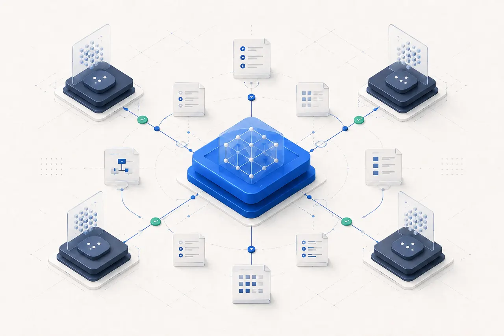

# ReleaseWitness

English | [Tiếng Việt](README-vi.md)

[](https://github.com/thuanlyt/releasewitness/actions/workflows/ci.yml)
[](https://github.com/thuanlyt/releasewitness/releases/latest)
[](https://www.python.org/downloads/)
[](LICENSE)

> Your coding agent says it's done.
> ReleaseWitness checks the evidence behind that claim.
>
> Source-bound evidence and release assurance for AI-written code.

> ReleaseWitness was formerly released as UseAgent in the v0.1.x series.



## What ReleaseWitness is

ReleaseWitness keeps the proof around AI-assisted coding in the repository
that is being changed. It records evidence provenance, bounds and sanitizes
durable output, binds QA to a source snapshot, verifies review evidence and
checks Git release durability before a release decision.

The result is a compact, inspectable trail for the questions that matter:

- What changed, and which source state was checked?
- Which evidence is local, live, simulated or blocked?
- Did review and QA verify the same source that is ready to ship?
- Is the repository clean and durable enough for the next release gate?

ReleaseWitness is provider-neutral and trusted-local. It complements the
coding runtime rather than trying to become one.

## Current Release

**v0.1.1 — Distribution & Positioning Maintenance**

v0.1.1 is the current public maintenance release, published under the former
UseAgent name. It adds no new feature set: it cleans the public distribution
and aligns the project with its release-assurance positioning. The feature
set is frozen; future changes require a concrete bug, security issue, real
external-user evidence or an explicit owner decision.

- [Release notes](https://github.com/thuanlyt/releasewitness/releases/tag/v0.1.1) · [All releases](https://github.com/thuanlyt/releasewitness/releases)
- [CHANGELOG](CHANGELOG.md) · [Documentation](https://useagent.thuanlyt.id.vn/) · [Getting started](docs/getting-started.md)

The public repository does not ship a maintainer's runtime history. `work/`
is generated locally by `init` in the project being assured.

## Why teams use it

| Release-assurance problem | ReleaseWitness response |
| --- | --- |
| AI output is hard to audit later | Typed evidence provenance and source-anchored handovers |
| A green check may belong to an older tree | Source-bound QA and explicit freshness checks |
| Raw runner output can contain secrets | Bounded sanitized summaries plus a local diagnostic spool |
| “Done” is confused with “ready to release” | Separate review, QA and Git durability gates |
| Long work loses its durable context | Compact knowledge cards, reports and checkpoints |
| Different coding runtimes use different workflows | One repository-local contract around their output |

## Why ReleaseWitness if I already use Claude Code, Codex, Beads or worktrees?

Those tools plan and execute work. ReleaseWitness verifies the evidence and
release state around the resulting repository. It can sit beside them
without asking them to surrender their native planning, subagents, branches
or worktree management:

```text
Claude Code / Codex / Beads / worktrees
        plan and execute
                ↓
ReleaseWitness verifies evidence, source identity and release durability
```

ReleaseWitness is a complement, not a replacement for Beads, Spec Kit, native
Claude or Codex subagents, Git worktree managers or a project's CI system.

## What it verifies

- Evidence is labeled with controlled provenance and repeatable source anchors.
- Durable runner and QA summaries are bounded and sanitized; raw diagnostics
  remain local by default.
- QA is bound to Git HEAD, source content, dirty-state provenance and QA
  configuration.
- Review evidence is required before a work item is considered done.
- Release durability checks the relevant Git cleanliness, untracked files and
  current QA validity separately from task completion.
- Configured quality gates remain explicit and deployment authority stays with
  the project owner.

## Optional lightweight supervision

When a project wants a supervisor, `$relwit` can turn a short goal into a
bounded workflow: record assumptions, create dependency-aware work items,
dispatch assignments, ingest reports, inspect evidence, run QA and checkpoint
the next action. The DAG, mailbox, role and telemetry machinery remains
available, but it is an optional coordination capability—not the product's
primary identity.

Workflow roles are personas, not vendor identities:

| Role | Responsibility |
| --- | --- |
| `supervisor` | Plan bounded work, review evidence and choose the next safe action |
| `explorer` | Read-only discovery and source anchors |
| `planner` | Decompose a goal into scoped work items |
| `worker` | Implement one claimed scope and report checks |
| `reviewer` | Verify diff, regressions, security and evidence |
| `release_gate` | Check release readiness and operational evidence |

Codex, Claude Code, Google Antigravity and other coding agents can be workers
when they can read the repository contract, run the CLI and respect scope.
See the [practical runtime guide](docs/getting-started.md).

## Judgment-aware supervision

The optional supervisor records the decision boundary, not a hidden chain of
thought. For each bounded cycle it should state the intent, tradeoff, owner,
evidence anchors and next action or stop condition. When the marginal value is
low or the evidence is ambiguous, it should stop and ask the owner instead of
creating more work. This keeps coordination useful while respecting
diminishing returns and the trusted-local boundary.

## Quick start for an external project

ReleaseWitness is normally cloned or installed once, then pointed at the
repository you want to assure. Do not use the ReleaseWitness source checkout
as the default application workspace.

Requirements: Python 3.11+, Git, and an existing target repository.

```powershell
git clone https://github.com/thuanlyt/releasewitness.git F:\tools\RelWit
python F:\tools\RelWit\relwit\cli.py --root F:\dev\MyProject init
```

`init` creates empty local state under `F:\dev\MyProject\work`. It does not
copy skills or overwrite project files. For the full workflow, copy or merge
the ReleaseWitness control-plane files (`AGENTS.md`, `.agents/skills/`,
`knowledge/`, `relwit/` and configuration) into the target repository,
preserving the target project's own instructions and source. Then run:

```powershell
python F:\tools\RelWit\relwit\cli.py --root F:\dev\MyProject validate
```

The `--root` boundary covers the registry, reports, evidence, checkpoints and
all configured paths. Paths that escape it are rejected. If the CLI has been
installed, the equivalent form is:

```powershell
python -m pip install --no-deps F:\tools\RelWit
relwit --root F:\dev\MyProject init
relwit --root F:\dev\MyProject validate
```

`python -m relwit` is equivalent to the installed `relwit` entry point.

Read [getting started](docs/getting-started.md) before registering workers.

## The assurance loop

The core path is useful with one agent or many:

```text
implement → report evidence → review → source-bound QA → Git durability gate
```

If supervision is enabled, the optional loop adds:

```powershell
relwit supervisor cycle --run-qa
relwit supervisor report --check
```

Workers can use the generated mailbox/report protocol, but a project may also
use ReleaseWitness around work planned by an external orchestrator. A worker
report is not a release decision; the reviewer, QA and durability gates
remain separate.

## Trust model and concurrency boundary

ReleaseWitness is designed for a **trusted-local / trusted-repository**
threat model. Its scope and role checks are workflow controls, not an OS
sandbox, authenticated distributed lock or authenticated agent identity
system.

ReleaseWitness does not own:

- branches, worktrees or parallel process isolation;
- provider accounts, quotas or vendor API launch flags;
- a project's task graph when another orchestrator already owns it;
- deployment or external mutations.

External orchestrators may manage branches, worktrees, parallel execution and
task graphs. ReleaseWitness can verify the resulting repository state. The
shared folder and mailbox workflow documented in the optional supervision
guide is deliberately lightweight and trusted-local.

## Repository and documentation map

| Path | Purpose |
| --- | --- |
| `.agents/skills/` | Optional supervisor, context, worker, review and autopilot skills |
| `.codex/agents/` | Optional role-specific Codex profiles |
| `knowledge/` | Compact project brief, architecture, contracts and decisions |
| `relwit/` | Dependency-free assurance CLI and validator (`relwit/cli.py`) |
| `relwit.config.json` | Paths, QA and production-readiness configuration |
| `work/` | Generated local registry, reports, evidence and checkpoints after `init` |
| `docs/` | Canonical hands-on, operations, architecture and case-study docs |
| `docs-site/` | Crawlable bilingual static documentation site |
| `tests/` | Standard-library regression and docs-site tests |

The [OSBlog dogfooding case study](docs/case-study-osblog.md) shows how a real
workload used evidence, QA and recovery boundaries. OSBlog is a workload and
evidence source, not the product being positioned here. The case study
predates the rebrand and still cites the original `UA-####` work-item IDs it
was evidenced under.

## Packaging note

The public entry point is `relwit = relwit.cli:main`, backed by a dedicated
top-level `relwit` package (`packages = ["relwit"]`). This replaces the
former `tools`-namespaced layout (`useagent = tools.useagent:main`), which
was retired during the ReleaseWitness rebrand to remove a generic
top-level-package collision risk. The installed CLI and wheel smoke path
remain dependency-free.

## Contributing and license

Contributions follow the [work-item and review contract](CONTRIBUTING.md). For
security reports, read [SECURITY.md](SECURITY.md). The project is released under
the [MIT License](LICENSE).

---

## 💖 Support the Project

ReleaseWitness is **free and open source**. If it saves you time, please give
us a ⭐ **Star** — it keeps the project alive and helps us ship more skills.

<a href="https://github.com/thuanlyt/releasewitness/stargazers">
  
</a>

### 🤝 Community & Support
- 📖 [Read the Docs](https://useagent.thuanlyt.id.vn/)
- 🐛 [Report an Issue](https://github.com/thuanlyt/releasewitness/issues)
- 🌐 [ThuanLYT Website](https://thuanlyt.id.vn)

<p align="center"><em>Built with ❤️ by ThuanLYT</em></p>
