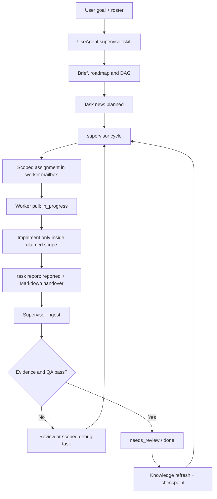

# UseAgent

> A durable, file-first supervisor skill for coordinating multiple AI agents toward a production-ready result.
>
> Bộ skill supervisor bền vững, file-first để điều phối nhiều AI agent cùng làm việc hướng tới sản phẩm hoàn chỉnh.

[](https://github.com/thuanlyt/UseAgent/actions/workflows/ci.yml)
[](LICENSE)

English | [Tiếng Việt](#tiếng-việt)

## English

### What is UseAgent?

UseAgent turns one capable model into a project supervisor and gives the rest of the agents a shared operating protocol. You provide a lightweight goal and an agent roster; the supervisor derives a roadmap, creates scoped work items, dispatches ready tasks, reads evidence-backed reports, runs configured QA, and continues through bounded checkpoints.

The central loop is:

```text
User goal
   ↓
UseAgent supervisor
   ├─ project brief + roadmap + dependency graph
   ├─ scoped task registry
   ├─ worker mailboxes and prompts
   └─ reports, QA, review, evidence, checkpoints
   ↓
Worker agents
   ↓
UseAgent supervisor
   ↓
User status, decisions, blockers and next action
```

UseAgent is intentionally small and transparent:

- repository-local skills teach a model how to supervise, orchestrate, work, review, build context and run bounded autopilot cycles;
- a dependency-free Python CLI owns state transitions, locking, dispatch and Markdown reports;
- JSON is the machine-readable source of state, while Markdown is the human- and model-readable handoff surface;
- one writer owns a scope at a time, so agents can share a folder without silently overwriting one another.

UseAgent does not pretend that a filesystem can start an arbitrary external model by itself. The CLI creates durable assignments and prompts. A Codex subagent runtime, another compatible agent runner, a scheduler, or a human must invoke the worker. The supervisor then consumes the worker's report automatically on the next cycle.

### Why it exists

Multi-agent projects commonly lose time because context is reread from scratch, tasks are ambiguous, two agents edit the same files, and “completed” is confused with “verified”. UseAgent makes those boundaries explicit:

| Problem | UseAgent control |
| --- | --- |
| Agents reread the whole repository | Compact knowledge ledger with source anchors |
| Work disappears in chat | Durable task registry and Markdown mailboxes |
| Two workers edit the same scope | Active-writer conflict check |
| “Done” has no proof | Acceptance criteria, commands and evidence gates |
| Long runs lose direction | Bounded cycles and resumable checkpoints |
| Supervisors repeat stale conclusions | Ingested reports plus fresh QA evidence |

### Features

- Supervisor front door through `$useagent`.
- Five supporting skills: context, orchestrator, worker, review and autopilot.
- Work levels from L0 discovery to L4 production/release.
- Automatic task assignment based on status, scope, capabilities, preferred agents and capacity.
- Per-agent `INBOX.md`, `REPORT.md`, `COMPLETED.md` and assignment inbox.
- Global reports index, completed log, evidence directory and supervisor report.
- Atomic JSON writes and a short-lived cross-process state lock.
- Safe repository-relative paths; configured paths cannot escape the repository root.
- Configurable QA commands with timeout and persisted evidence.
- Cycle stop conditions for ambiguity, missing access, scope conflict, repeated failure and unsafe side effects.
- Custom Markdown paths for teams that already have an established folder layout.
- No third-party Python dependencies.
- Credential-free end-to-end conformance demo for the assignment/report protocol.
- Multi-runtime conformance harness for isolated Codex, Claude Code and Antigravity-style worker identities.

### Which agents are supported?

UseAgent supports any local coding-agent runtime that can access the same
repository, read Markdown, run the CLI and respect a declared file scope. The
repository ships role profiles for `supervisor`, `explorer`, `planner`,
`worker`, `reviewer` and `release_gate`; the default config registers only the
supervisor, so real worker sessions must be registered with unique ids.

Codex has the tightest integration through `$useagent`, `$useagent-worker` and
the optional `.codex/agents/` profiles. Claude Code and Google Antigravity work
through the same portable file protocol: open the target repository, read the
relevant `SKILL.md`, run `worker pull`, edit only the claimed scope and submit a
`task report`. UseAgent does not call a vendor API or require a vendor-specific
adapter.

If you are new to multi-agent work, read the complete
[hands-on onboarding guide](docs/getting-started.md) before registering agents.
It uses one concrete Codex + Claude Code + Antigravity example and shows the
exact prompts, commands, mailbox files and troubleshooting steps.

### Quick start

Prerequisites:

- Python 3.11 or newer.
- Git for versioning and optional worktrees.
- A model/agent runtime that can load repository skills. In Codex, use the repository-local `$useagent` skill; compatible runtimes can use the same Markdown contract.

```powershell
git clone https://github.com/thuanlyt/UseAgent.git
Set-Location UseAgent

python tools/useagent.py init
python tools/useagent.py validate
python -m unittest discover -s tests -v
python examples/multi-agent-demo/run_demo.py
python examples/multi-runtime-conformance/run_conformance.py
```

`tools/useagent.py` operates on the repository root that contains it. For a
different application, vendor or merge the UseAgent control-plane files into
that application's repository first; see
[Put the control plane in the target repository](docs/getting-started.md#2-put-the-control-plane-in-the-target-repository).

If the CLI is kept in a central UseAgent checkout, target an existing prepared
repository explicitly:

```powershell
python F:\dev\UseAgent\tools\useagent.py --root F:\dev\MyProject init
python F:\dev\UseAgent\tools\useagent.py --root F:\dev\MyProject validate
```

`--root` must appear before the subcommand. It makes the selected project root
the boundary for the registry, mailboxes, reports and configured paths; a
configured path that escapes that boundary is rejected.

For a reusable console command:

```powershell
python -m pip install --no-deps .
useagent --help
useagent validate
```

An installed CLI uses the current directory as its default root. Use
`useagent --root F:\dev\MyProject ...` when operating from a central checkout.

The public docs-site is also runnable locally:

```powershell
python docs-site/build.py --check-only
python docs-site/build.py --output dist
python -m http.server 4173 --directory docs-site/dist
```

Open `http://localhost:4173` for the English experience or the Vietnamese
entry point at `/vi.html`. The hosting and custom-domain path is documented and
gated separately; no DNS is changed by this repository command.

For a new project, register the workers that actually exist:

```powershell
python tools/useagent.py agent register `
  --id backend `
  --role worker `
  --scope src/backend `
  --scope tests `
  --capability python `
  --max-active 1

python tools/useagent.py agent register `
  --id reviewer `
  --role reviewer `
  --scope src/backend `
  --scope tests `
  --capability review `
  --max-active 1
```

Then give the supervisor a small prompt. It should not be necessary to design the DAG or write worker prompts yourself:

```text
Use $useagent in F:\dev\MyProject.
Goal: build a production-ready inventory API with authentication and tests.
Agents: backend (Python), frontend (web), reviewer (security and QA).
Constraints: use the existing repository conventions; do not deploy without approval.
Plan the roadmap, create scoped tasks, dispatch ready work, inspect reports, run QA,
and continue in bounded cycles until a production gate is evidenced or a blocker
requires my decision.
```

### The worker and supervisor loop

The CLI is deterministic; the model supplies planning and judgment.



One bounded cycle is finite. It may end in `complete`, `blocked` or `needs_input`; a scheduler may invoke another cycle later, but UseAgent never creates an unbounded self-loop or deploys on its own.

### Work levels and statuses

| Level | Intended use |
| --- | --- |
| L0 | Discovery, inventory, constraints and unknowns |
| L1 | Small isolated change or focused documentation |
| L2 | Feature slice spanning a module and tests |
| L3 | Cross-module integration, migration or release preparation |
| L4 | Production gate, operational readiness and release evidence |

Normal task flow:

```text
planned → assigned → in_progress → reported → needs_review → done
                                      ↘ blocked / cancelled
```

`reported` means the worker submitted a handover. It is not the same as production-ready. A task reaches `done` only after the supervisor/reviewer accepts its criteria and evidence.

### Repository structure

```text
UseAgent/
├── .agents/skills/              Repository-local skills discovered by agents
│   ├── useagent/                Supervisor front door
│   ├── useagent-context/        Compact knowledge ledger
│   ├── useagent-orchestrator/   DAG, dispatch and coordination
│   ├── useagent-worker/         Scoped implementation handover
│   ├── useagent-review/         Evidence, regressions and security review
│   └── useagent-autopilot/      One bounded long-running cycle
├── .codex/agents/               Optional role-specific Codex agent profiles
├── .github/                     CI, issue forms and pull-request template
├── docs/                        Public operations and autopilot guides
├── knowledge/                   Compact source-anchored project context
│   ├── INDEX.md                 Required context entry point
│   ├── architecture.md          Invariants and coordination model
│   ├── project-brief.md         Goal, stack assumptions and definition of done
│   ├── project-map.md           Repository map and source anchors
│   ├── modules/                 Module cards
│   ├── contracts/               Stable file/CLI contracts
│   └── decisions/               Architecture decision records
├── templates/                   Work item, module, decision and checkpoint templates
├── tests/                       Standard-library unit tests
├── tools/useagent.py            Dependency-free control-plane CLI
├── useagent.config.json         Paths, roster, QA and production gates
└── work/                        Durable state and Markdown handoff surface
    ├── agents/<agent>/          INBOX, REPORT, COMPLETED and private inbox
    ├── items/                   One Markdown file per task
    ├── reports/                 Incoming reports, archive and index
    ├── completed/               Global completed-task log
    ├── evidence/                Reproducible command output and artifacts
    ├── checkpoints/             Resume points for long-running work
    ├── outbox/                  Prompts for external worker runtimes
    └── registry.json            Machine-readable task state
```

Read `knowledge/INDEX.md` before opening source files. Use `python tools/useagent.py context --task <id>` when a bounded snapshot is enough.

### Creating, dispatching and reporting work

Create a scoped task with explicit acceptance criteria:

```powershell
python tools/useagent.py task new `
  --title "Implement inventory endpoint" `
  --objective "Expose authenticated inventory reads" `
  --level L2 `
  --owner supervisor `
  --scope src/api/inventory.py `
  --scope tests/test_inventory.py `
  --capability python `
  --acceptance "GET /inventory returns the authenticated user's items" `
  --acceptance "Unauthenticated access is rejected" `
  --verification "python -m unittest discover -s tests -v"

python tools/useagent.py supervisor dispatch
python tools/useagent.py worker pull --agent backend
```

After implementation, the worker reports evidence through the CLI:

```powershell
python tools/useagent.py task report UA-0001 `
  --agent backend `
  --result completed `
  --summary "Inventory endpoint implemented with focused tests" `
  --next-action "Reviewer checks auth boundary and regression evidence" `
  --file src/api/inventory.py `
  --file tests/test_inventory.py `
  --check "python -m unittest discover -s tests -v: pass"
```

The report is written to the configured report inbox, the worker's `REPORT.md`, the global reports index, and `work/completed/COMPLETED.md`. The task remains reviewable until the supervisor accepts it.

Useful commands:

```powershell
python tools/useagent.py task list
python tools/useagent.py task show UA-0001
python tools/useagent.py supervisor ingest
python tools/useagent.py supervisor report
python tools/useagent.py supervisor qa
python tools/useagent.py supervisor cycle --run-qa
python tools/useagent.py checkpoint create `
  --name "after-inventory" `
  --status active `
  --summary "Inventory implementation reported; review pending" `
  --next-action "Run security review and close evidence gaps"
```

### Configuration

`useagent.config.json` is the project contract. Keep paths repository-relative and commit the intended shared layout.

```json
{
  "supervisor": {
    "max_assignments_per_cycle": 4,
    "run_qa_each_cycle": false,
    "qa_timeout_seconds": 900,
    "qa_commands": [
      "python -m unittest discover -s tests -v",
      "python tools/useagent.py validate"
    ],
    "operational_readiness_files": [
      "docs/operations.md",
      "docs/autopilot.md"
    ],
    "production_gates": [
      "Acceptance criteria have repeatable evidence",
      "Focused and integration tests pass",
      "No open P0/P1 review finding",
      "Operational and rollback notes exist"
    ]
  },
  "agents": []
}
```

Use `agent register` to add the roster. It creates the standard Markdown mailboxes automatically. Existing teams may set `--directory`, `--inbox-file`, `--report-file` and `--completed-file` to use explicit paths; all paths are validated to stay inside the repository.

### Parallel work and Git worktrees

Read-only exploration, test analysis and documentation analysis can run in parallel. Writers must have non-overlapping scopes. For a first setup, keep all
agents in one checkout so they see the same `work/registry.json`; if two changes
need the same files, serialize the tasks. Git worktrees isolate source files
but also have separate checkout copies of the file-first `work/` ledger, so use
them only with an explicit process for returning reports/evidence to the
canonical supervisor checkout. The short-lived state lock protects metadata
transitions; it is not a substitute for source ownership. See the
[shared-folder and worktree guide](docs/getting-started.md#5-shared-folder-or-git-worktree).

### Production gate

UseAgent considers a project ready only when the supervisor can point to:

1. acceptance criteria and implementation evidence for every release task;
2. focused, integration and configured QA results;
3. review evidence with no unresolved critical/high finding;
4. operational, observability, rollback and recovery notes;
5. explicit user authorization for deployment or other external side effects.

UseAgent can prepare release evidence. It does not deploy, migrate destructively, change secrets/permissions, or call external services unless a higher-level prompt authorizes that action.

### Validation and contribution

Run the same checks locally and in CI:

```powershell
python -m py_compile tools/useagent.py tests/test_useagent.py
python -m unittest discover -s tests -v
python tools/useagent.py validate
```

See [CONTRIBUTING.md](CONTRIBUTING.md) for the work-item and review contract, [SECURITY.md](SECURITY.md) for responsible disclosure, [docs/operations.md](docs/operations.md) for daily operation, [docs/autopilot.md](docs/autopilot.md) for bounded long-running cycles, and [docs/architecture.md](docs/architecture.md) for the public architecture guide.

### Relationship to Codex

UseAgent is designed to work with repository-local skills and specialized subagents. Codex's official documentation describes repository customization with `AGENTS.md`, skills and subagents, as well as long-running work and Git worktrees:

- [Custom agents and subagents](https://learn.chatgpt.com/docs/agent-configuration/subagents)
- [Build skills](https://developers.openai.com/plugins/build/skills)
- [Long-running work](https://learn.chatgpt.com/docs/long-running-work)
- [Git worktrees](https://learn.chatgpt.com/docs/environments/git-worktrees)
- [Automations](https://learn.chatgpt.com/docs/automations)

The repository protocol remains useful outside Codex because its state and handovers are plain JSON and Markdown. For provider-specific setup, see the
[hands-on onboarding guide](docs/getting-started.md#3-complete-example-codex--claude-code--antigravity).

### License

Released under the [MIT License](LICENSE).

---

## Tiếng Việt

### UseAgent là gì?

UseAgent biến một model có năng lực thành supervisor của dự án và cung cấp cho các agent còn lại một giao thức làm việc chung. Người dùng chỉ cần đưa goal ngắn và roster agent; supervisor tự suy ra roadmap, tạo task có scope, dispatch task sẵn sàng, đọc report có evidence, chạy QA đã cấu hình và tiếp tục qua các checkpoint hữu hạn.

Luồng trung tâm:

```text
Goal người dùng
   ↓
UseAgent supervisor
   ├─ project brief + roadmap + dependency graph
   ├─ task registry có scope
   ├─ mailbox và prompt cho worker
   └─ report, QA, review, evidence, checkpoint
   ↓
Các worker agent
   ↓
UseAgent supervisor
   ↓
Người dùng nhận trạng thái, quyết định, blocker và next action
```

UseAgent không tuyên bố filesystem có thể tự khởi chạy một model bên ngoài. CLI tạo assignment và prompt bền vững; Codex subagent runtime, agent runner tương thích, scheduler hoặc con người phải thực sự gọi worker. Ở cycle tiếp theo supervisor sẽ tự ingest report của worker.

### Mục tiêu vận hành

- Agent không phải đọc lại toàn bộ code: dùng knowledge ledger có source anchor.
- Task không bị mất trong chat: dùng registry và mailbox Markdown bền vững.
- Không cho hai writer cùng sửa một scope.
- “Đã báo cáo” không bị nhầm là “đã production-ready”.
- Long-running work có cycle hữu hạn, checkpoint và điều kiện dừng rõ ràng.
- Worker tự nhận task được dispatch, tự ghi report/completed theo các file đã cấu hình.
- Supervisor tự xem report, completed log, QA và lên task debug còn thiếu ở cycle sau.

### Bắt đầu nhanh

Yêu cầu: Python 3.11+, Git và model/agent runtime có thể load repository skill.

```powershell
git clone https://github.com/thuanlyt/UseAgent.git
Set-Location UseAgent
python tools/useagent.py init
python tools/useagent.py validate
python -m unittest discover -s tests -v
```

Nếu bạn chưa từng dùng hệ multi-agent, hãy đọc trước
[Hướng dẫn thao tác thực tế](docs/getting-started.md#hướng-dẫn-thao-tác-thực-tế-bằng-tiếng-việt).
Tài liệu này dùng ví dụ cụ thể Codex + Claude Code + Antigravity và chỉ rõ
người dùng phải mở session nào, gửi prompt nào, xem file nào và xử lý lỗi ra
sao.

Đăng ký roster thật sự có trong dự án:

```powershell
python tools/useagent.py agent register `
  --id backend --role worker `
  --scope src/backend --scope tests `
  --capability python --max-active 1

python tools/useagent.py agent register `
  --id reviewer --role reviewer `
  --scope src/backend --scope tests `
  --capability review --max-active 1
```

Prompt tối giản cho supervisor:

```text
Use $useagent trong F:\dev\MyProject.
Goal: xây dựng inventory API production-ready có authentication và test.
Agents: backend (Python), frontend (web), reviewer (security và QA).
Constraints: theo convention hiện có; không deploy nếu chưa được phép.
Hãy tự lập roadmap, tạo task có scope, dispatch, đọc report, chạy QA và tiếp tục
từng cycle hữu hạn cho tới production gate hoặc khi cần tôi quyết định blocker.
```

### Cách hoạt động

Supervisor model lập kế hoạch và phán đoán; CLI đảm bảo state transition, lock, dispatch và ghi Markdown nhất quán. Trạng thái chuẩn là:

```text
planned → assigned → in_progress → reported → needs_review → done
                                      ↘ blocked / cancelled
```

`reported` chỉ có nghĩa worker đã nộp handover. Chỉ sau khi supervisor/reviewer xác nhận acceptance criteria và evidence thì task mới `done`.

### Các agent/runtime được hỗ trợ

Các role chuẩn của UseAgent là `supervisor`, `explorer`, `planner`, `worker`,
`reviewer` và `release_gate`. `Codex`, `Claude Code` và `Antigravity` là runtime
để chạy các role đó, không phải ba role cố định. Bạn có thể dùng Codex làm
supervisor, Claude Code làm worker frontend và Antigravity làm worker QA trong
cùng repository.

- Codex: hỗ trợ trực tiếp `$useagent`, `$useagent-worker` và profile trong
  `.codex/agents/`.
- Claude Code: mở local session trong cùng repository, đọc trực tiếp
  `.agents/skills/useagent-worker/SKILL.md` nếu alias skill không tự nhận, rồi
  chạy CLI.
- Antigravity: mở đúng repository dưới dạng Project/local mode, đọc skill trong
  `.agents/skills/` và dùng cùng `worker pull`/`task report`.

UseAgent không tự gọi API của nhà cung cấp và không tự khởi chạy model bên
ngoài. Supervisor tạo prompt bền vững tại `work/outbox/`; runtime tương ứng
phải thực thi prompt đó. Xem [hướng dẫn thực chiến](docs/getting-started.md)
để có câu lệnh và prompt copy được.

### Cấu trúc thư mục

Các thư mục chính gồm `.agents/skills` (skill), `.codex/agents` (profile agent), `knowledge` (ngữ cảnh cô đọng), `work` (registry/mailbox/report/evidence/checkpoint), `tools/useagent.py` (CLI), `useagent.config.json` (cấu hình), `docs` (tài liệu công khai) và `tests` (kiểm thử). Xem cây đầy đủ ở phần [Repository structure](#repository-structure).

Người mới nên bắt đầu tại [docs/getting-started.md](docs/getting-started.md),
không cần đọc toàn bộ cây thư mục trước.

Luôn đọc `knowledge/INDEX.md` trước khi đọc code. Với task cụ thể, chạy `python tools/useagent.py context --task <id>` để lấy snapshot giới hạn token.

### Worker tự nhận task và tự báo cáo

Supervisor chạy:

```powershell
python tools/useagent.py supervisor cycle --run-qa
```

CLI sẽ ingest report đến, tìm task `planned` không còn dependency, chọn worker phù hợp theo scope/capability/capacity, ghi assignment vào `work/agents/<agent>/INBOX.md` và prompt chi tiết vào `work/outbox/`. Worker chạy:

```powershell
python tools/useagent.py worker pull --agent backend
python tools/useagent.py task report UA-0001 `
  --agent backend --result completed `
  --summary "Đã hoàn tất implementation và test" `
  --next-action "Reviewer kiểm tra evidence" `
  --file src/api/inventory.py `
  --check "python -m unittest discover -s tests -v: pass"
```

Report được ghi vào report inbox, `REPORT.md` của agent, report index và `work/completed/COMPLETED.md`. Supervisor đọc các file này ở cycle tiếp theo, chạy QA, tạo debug task nếu fail, cập nhật knowledge và checkpoint.

### An toàn và production

Không deploy, xóa dữ liệu, migration destructive, đổi secret/quyền hoặc gọi dịch vụ ngoài nếu prompt cấp trên chưa cho phép. Worker chỉ sửa trong scope đã claim; task cùng file phải tuần tự hoặc chạy trong Git worktree riêng. Một cycle luôn có điểm dừng `complete`, `blocked` hoặc `needs_input`.

Production gate cần có acceptance/evidence, test và QA, review không còn finding nghiêm trọng, operational/rollback notes và quyền deploy rõ ràng. UseAgent chuẩn bị bằng chứng phát hành chứ không tự deploy.

Mô hình shared-folder, cách đăng ký từng runtime và quy trình Codex + Claude Code
và Antigravity được minh họa đầy đủ trong [hướng dẫn onboarding](docs/getting-started.md).

### Đóng góp, kiểm thử và giấy phép

Chạy:

```powershell
python -m py_compile tools/useagent.py tests/test_useagent.py
python -m unittest discover -s tests -v
python tools/useagent.py validate
```

Đọc [CONTRIBUTING.md](CONTRIBUTING.md), [SECURITY.md](SECURITY.md), [docs/operations.md](docs/operations.md), [docs/autopilot.md](docs/autopilot.md) và [docs/architecture.md](docs/architecture.md). Dự án phát hành theo [MIT License](LICENSE).
