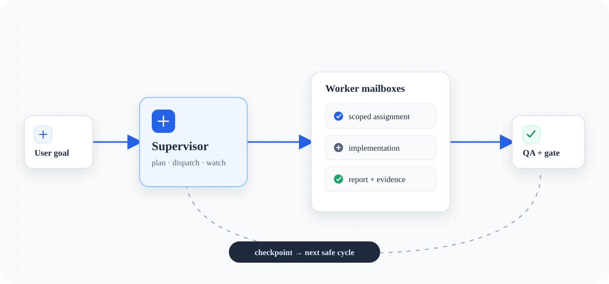

# UseAgent architecture / Kiến trúc UseAgent

## English

UseAgent is a repository-local evidence and release-assurance layer for AI
coding workflows. It does not replace the model, runtime or external
orchestrator that plans and executes work. Lightweight supervision is an
optional capability that makes relevant shared state explicit and reviewable.

*The visual summary: the supervisor turns one goal into scoped work, then uses
reports, QA and checkpoints to choose the next safe cycle.*

### Layers

1. **Assurance CLI** — `tools/useagent.py` validates evidence, review transitions, source-bound QA and Git release durability.
2. **Optional supervision skills** — context, orchestration, worker implementation, review and autopilot provide narrow operating instructions when a project wants coordination.
3. **Evidence ledger** — `knowledge/` and generated `work/` state keep provenance, handovers and checkpoints inspectable.
4. **Knowledge ledger** — `knowledge/` stores compact, source-anchored context so agents do not reread unrelated files.
5. **Optional work ledger** — `work/` is generated in the assured project after `init`; it stores registry state, work items, mailboxes, reports, evidence and checkpoints when coordination is enabled.
6. **Repository rules** — `AGENTS.md` defines the safety boundary: explicit scope, evidence-backed handover and no unapproved side effects.

### State ownership

When optional supervision is enabled, `work/registry.json` is the machine-readable
source of truth for task state. Each task also has
`work/items/<task-id>.md` for readable acceptance criteria and handover. Markdown
reports are append-oriented communication artifacts; they do not silently
override the registry. A fresh UseAgent clone intentionally has no maintainer
task history; `init` creates empty local state in the project being assured.

The CLI uses atomic replacement for files and a short-lived exclusive lock for
state transitions. The lock is released before worker code, tests or external
processes run. Paths from configuration are resolved and rejected if they leave
the repository root. These are trusted-local workflow controls, not a sandbox or
authenticated distributed concurrency service.

### Scheduling model

If supervision is enabled, the supervisor selects tasks that are `planned` and
whose dependencies are complete. A worker is eligible when it is available,
below `max_active`, matches the task's preferred agent/capability constraints,
and has no overlapping active writer scope. A dispatch writes both a mailbox
assignment and an outbox prompt, then marks the task `assigned`.

The worker claims through `worker pull` or `task claim`, which changes `assigned` to `in_progress`. It may report through `task report` only after that activation; the command writes the report inbox, per-agent report/completed files, global completed log, report index and task handover metadata.

### Production gates

The default gates are intentionally conservative:

- every acceptance criterion has repeatable evidence;
- focused and integration QA pass;
- no open P0/P1 review finding;
- operational and rollback notes exist.

Deployment remains outside the CLI. A supervisor may recommend a release only after the gates are evidenced and the user explicitly authorizes external side effects.

## Tiếng Việt

UseAgent là lớp evidence và release-assurance nằm trong repository. Nó không
thay thế model, runtime hay orchestrator bên ngoài lập kế hoạch và thực thi
work. Supervisor nhẹ là capability tùy chọn để state cần thiết rõ ràng và có
thể review.

*Sơ đồ chỉ để định hướng nhanh; contract và state thực tế vẫn nằm trong
`knowledge/`, `work/` và CLI.*

### Các lớp kiến trúc

1. **Assurance CLI** kiểm tra evidence, review transition, source-bound QA và Git release durability.
2. **Supervisor skill tùy chọn** gồm context, orchestrator, worker, review và autopilot khi project cần điều phối.
3. **Evidence ledger** trong `knowledge/` và state `work/` local giữ provenance, handover và checkpoint.
4. **Knowledge ledger** trong `knowledge/` lưu ngữ cảnh cô đọng có source anchor.
5. **Work ledger tùy chọn** trong `work/` được `init` tạo rỗng tại project cần assurance.
6. **Repository rules** trong `AGENTS.md` áp dụng scope rõ ràng, handover có bằng chứng và cấm side effect chưa được phép.

### Giao thức file

Khi bật supervision, `work/registry.json` là nguồn sự thật dạng máy cho trạng
thái task. Mỗi task có thêm `work/items/<task-id>.md` để người và model đọc
acceptance criteria. Report Markdown là artifact giao tiếp; không được dùng để
âm thầm ghi đè registry. Clone UseAgent mới không chứa task history của
maintainer; `init` tạo state local rỗng trong project được assurance.

CLI ghi file theo cách atomic, dùng exclusive lock ngắn cho transition, giải
phóng lock trước khi chạy code/test, và từ chối mọi path cấu hình đi ra ngoài
repository. Đây là workflow control trusted-local, không phải sandbox hay hệ
thống concurrency phân tán có authentication.

### Mô hình dispatch

Nếu bật supervision, supervisor chọn task `planned` đã hoàn tất dependency.
Worker phải available, chưa vượt `max_active`, khớp agent/capability và không
trùng active writer scope. Dispatch ghi assignment vào mailbox và prompt vào
outbox, rồi chuyển task thành `assigned`.

Worker dùng `worker pull` hoặc `task claim` để chuyển sang `in_progress`, chỉ sửa trong scope đã claim và chỉ nộp bằng `task report` sau khi activation. Lệnh report cập nhật report inbox, file của agent, completed log toàn cục, report index và handover của task.

### Production gate

Mặc định phải có evidence lặp lại cho acceptance, QA focused/integration pass, không còn finding P0/P1 và có operational/rollback notes. CLI không tự deploy; side effect bên ngoài luôn cần prompt cấp trên cho phép.
