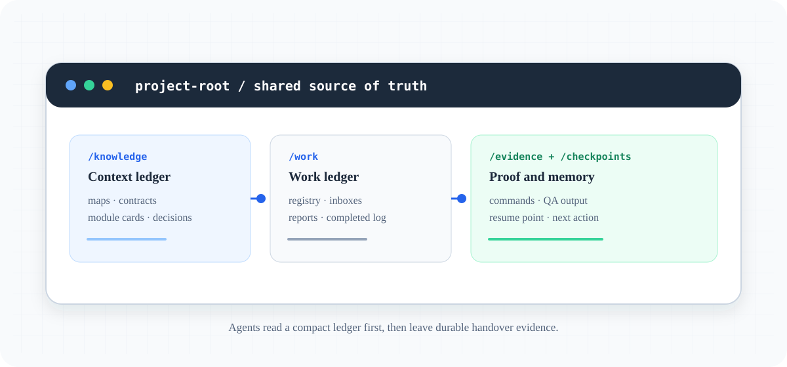

# UseAgent operations

## Install the CLI

UseAgent can run directly from a checkout, or as an installed console command:

```powershell
python -m pip install --no-deps .
useagent --help
useagent validate
```

The installed command uses the current directory as its default project root.
To operate on another prepared repository, pass the root before the command:

```powershell
useagent --root F:\dev\DemoStore validate
useagent --root F:\dev\DemoStore supervisor cycle --run-qa
```

The package has no runtime dependencies. Python 3.11 or newer is required;
the build backend is used only during installation.

## Tạo task

```powershell
python tools/useagent.py task new `
  --title "Implement feature X" `
  --level L1 `
  --owner worker `
  --scope src/backend/x.py tests/test_x.py `
  --acceptance "Behavior X works" `
  --acceptance "Focused regression test passes"
```

Task được tạo ở `planned`. Planner nên tách dependency trước khi giao worker.

## Đăng ký worker và tự dispatch

```powershell
python tools/useagent.py agent register --id backend --role worker --scope src/backend --scope tests --capability python
python tools/useagent.py agent register --id frontend --role worker --scope src/frontend --scope tests --capability web
python tools/useagent.py supervisor cycle
```

`supervisor cycle` tìm task ready, tự chọn worker còn rảnh theo scope/capability, ghi assignment vào `work/agents/<id>/inbox/`, cập nhật `INBOX.md`, và tạo prompt gửi ngoài phiên tại `work/outbox/`. Nếu Codex có subagent runtime, supervisor nên spawn worker trực tiếp; nếu không, gửi file outbox cho agent tương ứng.



*The repository is the shared memory: agents read compact context before code,
then leave reports, evidence and checkpoints for the next supervisor cycle.*

Có thể chỉ định file Markdown riêng cho từng worker:

```powershell
python tools/useagent.py agent register --id qaagent --directory work/qaagent `
  --inbox-file work/mail/qa-inbox.md `
  --report-file work/mail/qa-report.md `
  --completed-file work/mail/qa-completed.md
```

### Automatic worker intake (opt-in)

For a runtime that has a local CLI or adapter, register an argv-only runner once:

```powershell
python tools/useagent.py agent register --id codex-api --role worker `
  --scope src/backend --scope tests/backend `
  --runner-arg=python `
  --runner-arg=tools/codex_worker_adapter.py `
  --runner-arg=--assignment `
  --runner-arg={assignment_path} `
  --runner-timeout 3600
```

Then run a bounded intake window:

```powershell
python tools/useagent.py worker run --agent codex-api --max-tasks 3 --wait-seconds 300
```

The runner receives the generated assignment path and runs with the project
root as its working directory. It must use `task report`; UseAgent writes a
bounded, sanitized summary to `work/evidence/`, while a separate bounded,
redacted local diagnostic spool is stored under `work/.runtime-output/`. The
durable summary records `local_spool`, `provenance`, stream sizes, redaction
counts and an explicit truncation flag. The spool is ignored by Git and is the
place to inspect bounded diagnostic output; raw runtime output is never
treated as committable evidence by default. UseAgent automatically writes a
failed worker report if the process exits without reporting. `worker pull`
remains the manual path. No command is executed unless a runner is explicitly
configured; the command is an argv list and is never passed through a shell.

The adapter is the provider-specific boundary. Codex can wrap its installed
CLI, Claude Code can wrap `claude` from a local checkout, and Antigravity can
wrap an SDK/local Project runner. UseAgent intentionally does not guess vendor
flags or call vendor APIs. Test the adapter with one task before increasing
`--max-tasks`; `worker run` defaults to one task and never runs forever.

## Claim và thực thi

```powershell
python tools/useagent.py worker pull --agent backend
python tools/useagent.py context --task UA-0001
python tools/useagent.py task report UA-0001 --agent backend --result completed --summary "Implementation complete" --next-action "Review and QA" --file src/backend/x.py --check "python -m unittest: pass"
python tools/useagent.py worker run --agent backend --max-tasks 1
python tools/useagent.py supervisor cycle --run-qa
```

Worker report tự ghi vào `work/agents/backend/REPORT.md`, `work/reports/inbox/`, `work/reports/REPORTS.md` và `work/completed/COMPLETED.md`. Reviewer kiểm tra diff và evidence, sau đó cập nhật `needs_review`/`done`. Chỉ identity có role `supervisor`, `reviewer` hoặc `release_gate` được làm review; worker không thể tự approve hoặc tự close task.

Nếu đã cấu hình `runner` cho worker, dùng `worker run --agent <id>` để tự pull
assignment, gọi adapter trong một cửa sổ hữu hạn và kiểm tra report. Runner
không có report sẽ được ghi failed tự động để supervisor không bị kẹt ở
`in_progress`. Runner mặc định không tồn tại; đây là opt-in rõ ràng.

Worker phải dùng `task report` để chuyển task sang `reported`; không dùng
`task update --status reported`, vì CLI cố ý từ chối trạng thái reported không có
report Markdown và evidence đi kèm. Task cũng phải được `worker pull` hoặc
`task claim` kích hoạt trước; report trực tiếp từ `assigned` bị từ chối.

Reviewer chỉ được chuyển `reported` sang `needs_review`; task còn
`in_progress` phải chờ worker report trước khi review.

### Evidence provenance / Nguồn gốc evidence

Evidence mới nên gắn nhãn để supervisor không nhầm bản replay hoặc bản ghi cũ
với quan sát production:

```powershell
python tools/useagent.py task evidence UA-0001 `
  --kind smoke `
  --value "Vercel primary returned 200" `
  --provenance live `
  --source "https://example.invalid/health"
```

```powershell
python tools/useagent.py task report UA-0001 --agent backend `
  --result completed `
  --summary "Local implementation complete" `
  --next-action "Review and QA" `
  --provenance local `
  --source "python -m unittest tests/test_backend.py"
```

Các giá trị hợp lệ là `local`, `live`, `simulation`, `blocked` và
`operator-confirmed`. Report cũ không có field này được giữ nguyên và gắn
`legacy` khi ingest; đây không phải bằng chứng đã được xác minh. Provenance là
nhãn nguồn gốc, không phải chữ ký/authentication hay quyền tự duyệt. Mọi
evidence mới cũng lưu `recorded_at` và một `source` một dòng (command, URL hoặc
path) để reviewer có thể truy lại.

Sau khi `done` hoặc `cancelled`, task là terminal và không được reopen bằng
`task update`; hãy tạo task mới nếu phát hiện scope hoặc mục tiêu cần làm lại.

### Takeover lineage / Dòng kế thừa khi recovery

Khi một lần thử đã `blocked` hoặc `cancelled`, supervisor có thể tạo một task
takeover mới mà không xóa failure history:

```powershell
python tools/useagent.py task new `
  --title "Retry the blocked integration" `
  --level L2 `
  --owner supervisor `
  --scope src/integration.py `
  --acceptance "integration test passes" `
  --supersedes UA-0042 `
  --takeover-reason "Use a bounded fallback after the preserved blocker"
```

CLI sẽ ghi `supersedes` trên task mới, `superseded_by` trên predecessor và một
`takeover_reason` không rỗng trong cả registry lẫn Markdown item. Predecessor
vẫn giữ nguyên trạng thái và report/evidence cũ; nó không được claim hoặc đổi
lại sang `planned` sau khi đã bị takeover. Chỉ `blocked` hoặc `cancelled` mới
có thể làm predecessor; task đang active hoặc đã `done` bị từ chối trước khi
registry thay đổi. Không dùng takeover để che giấu quota failure, review gap
hoặc biến một task terminal thành task đang chạy.

Role `reviewer` và `release_gate` chỉ claim review/release evidence; họ không
được claim hoặc report implementation task. Các role hợp lệ được validator
kiểm tra là `supervisor`, `explorer`, `planner`, `worker`, `reviewer` và
`release_gate`.

`assigned` phải đi qua `worker pull` hoặc `task claim` để thành
`in_progress`; không dùng `task update` để bypass claim. Các thao tác
`planned`/`blocked`/`cancelled` bằng `task update` cần review-capable identity;
worker báo blocked bằng `task report --result blocked`. Khi claim hoặc pull,
agent cũng phải `available`, còn capacity dưới `max_active`, và task phải nằm
trong scope/capability đã đăng ký.

Quy trình review tối thiểu:

```powershell
python tools/useagent.py task evidence UA-0001 --kind review --agent reviewer --value "Diff, tests and security checks pass"
python tools/useagent.py task update UA-0001 --status needs_review --agent reviewer
python tools/useagent.py task update UA-0001 --status done --agent reviewer
```

`reviewer` phải là agent đã đăng ký trong roster và review value phải mô tả
evidence thực tế, không được để trống. `completed` trong log chỉ là worker đã
báo xong, không phải production-ready.

## Parallelism

- Explorer, test analyst và docs analyst có thể chạy song song nếu read-only.
- Worker chỉ chạy song song khi `scope` không giao nhau.
- Nếu task cần cùng file, dependency phải tuần tự hoặc mỗi nhánh dùng Git worktree.
- `work/.state.lock` chỉ rất ngắn cho state transition; không giữ lock trong lúc chạy test hay sửa code.

## Supervisor cycle và QA

```powershell
python tools/useagent.py supervisor ingest
python tools/useagent.py supervisor report
python tools/useagent.py supervisor qa
python tools/useagent.py supervisor cycle --retry-blocked --run-qa
```

Khai báo `supervisor.qa_commands` dạng mảng command string trong `useagent.config.json` để CLI chạy test/lint/build đã được project cho phép:

```json
{
  "supervisor": {
    "qa_commands": [
      "python -m unittest discover -s tests -v",
      "python tools/useagent.py validate"
    ]
  }
}
```

QA output follows the same evidence boundary as runner output. Each stdout and
stderr stream has a deterministic 4,000-character durable preview budget;
oversized streams are marked `truncated: true` and keep a `local_spool`
reference for debugging. The durable preview and command metadata are
sanitized as defense-in-depth, but sanitization is not a sandbox or an
authentication boundary. Raw or generated output must not be copied into
tracked `work/evidence/`; historical tracked evidence is preserved and needs
an explicit migration policy before any cleanup.

Every successful QA run also records a release-source fingerprint. It covers
the Git `HEAD` when available, content hashes for tracked and non-ignored
untracked files, the relevant dirty state and the QA/release configuration.
The configured `release_source.volatile_paths` are excluded so registry,
reports, checkpoints, evidence, runtime spool and other control-plane updates
do not invalidate a fresh QA result. A missing or mismatched fingerprint is
`QA_STALE`; the production snapshot rejects it and does not rerun QA
automatically. Run `python tools/useagent.py supervisor qa` again after a
source, test or QA/release configuration change.

### Local release durability / Độ bền source local

Task `done`, QA `pass` and local release durability are separate decisions. The
production snapshot adds `release_source_durability`. On a Git-backed project it
is `pass` only when Git `HEAD` is concrete, the release-source state is clean,
there are no non-ignored untracked release-source files, and the current QA
source fingerprint is valid. QA run on a dirty tree may remain valid for
development, but it cannot make the strong release gate ready. A commit after
QA changes the source identity, even when the file content is otherwise the
same, so QA must run again on the durable commit.

The snapshot also records the current branch, locally known upstream ref and
ahead/behind relation. These are observational metadata only: `origin/main` is
not required, ahead/behind does not fail local durability, and the CLI never
pulls, merges or pushes. When no upstream is configured the relation is
`none`; detached or unavailable tracking metadata is reported explicitly. A
workspace without Git uses `filesystem`/`manual` degraded mode and never claims
strong Git durability. Volatile control-plane writes remain excluded according
to `release_source.volatile_paths`, including the generated convenience report
at `work/SUPERVISOR_REPORT.md`.

### Report freshness / Tính mới của report

`work/registry.json` và task evidence là nguồn sự thật. `work/SUPERVISOR_REPORT.md`
chỉ là convenience view; mỗi report được sinh bởi CLI đều chứa revision SHA-256
của registry snapshot đã dùng. Kiểm tra report hiện tại mà không ghi lại file:

```powershell
python tools/useagent.py supervisor report --check
```

Lệnh trả `freshness=fresh` và exit code `0` chỉ khi marker khớp registry hiện tại.
`stale`, `unknown` (marker thiếu/hỏng) hoặc `missing` đều trả exit code `1`; khi đó
không được dùng report như trạng thái hiện tại, hãy đọc registry/task evidence hoặc
chạy lại `python tools/useagent.py supervisor report`.

`context` cũng gắn nhãn freshness và cảnh báo khi report không còn hiện tại.

## Handover

Tóm tắt bằng task id, trạng thái, file, command/evidence, blocker và next action. Worker dùng `task report`; supervisor dùng `work/SUPERVISOR_REPORT.md` và checkpoint. Ghi report dài vào `work/evidence/` và đặt path trong task.

## Kiểm tra toàn hệ thống

```powershell
python tools/useagent.py validate
python -m unittest discover -s tests -v
```

## Quyền và side effects

Skill chỉ điều phối workflow. Các hành động deploy, migration destructive, thay đổi secret, gọi connector hoặc mở rộng quyền phải được prompt cấp trên cho phép riêng.
